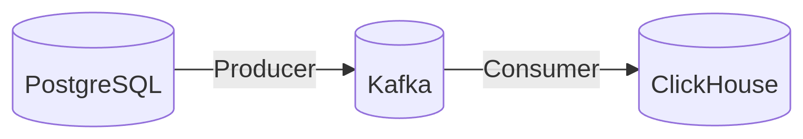

Пайплайн миграции данных PostgreSQL → Kafka → ClickHouse

---

### **Архитектура**



### **Компоненты:**

Producer (producer_pg_to_kafka.py):

    1.  Читает данные из таблицы user_logins в PostgreSQL

    2. Отправляет в топик Kafka user_events

    3. Извлекает записи с sent_to_kafka = FALSE

    4. Отправляет данные в Kafka топик user_events

    5. Обновляет флаг sent_to_kafka = TRUE

Consumer (consumer_to_clickhouse.py):

    1. Слушает топик user_events

    2. Автоматически создает таблицу в ClickHouse

    3. Записывает данные в таблицу user_logins в ClickHouse

    4. Использует Consumer Group - гарантирует обработку каждого сообщения только один раз

---

### **Требования**

 - Docker и Docker Compose

 - Python 3.8+

 - Библиотеки: json, kafka-python, psycopg2, clickhouse-connect,time

---

### **Этапы:**

#### 1. Клонирование репозитория
Скопируйте весь репозиторий (понадобится только файлы в папке 5.2):
```
git clone <repository-url>
cd repository_name
```
Или скачайте только файлы в папке 5.2

#### 2. Запуск docker-compose.yml:
--

docker-compose up -d

#### 3. Настройка PostgreSQL
--

Подключение к PostgreSQL
 - Порт: 5432
 - POSTGRES_USER: admin
 - POSTGRES_PASSWORD: admin
 - POSTGRES_DB: test_db

Создайте таблицу-источник:
```
CREATE TABLE user_logins (
    id SERIAL PRIMARY KEY,
    username TEXT,
    event_type TEXT,
    event_time TIMESTAMP,
    sent_to_kafka BOOLEAN DEFAULT FALSE
);
```
Добавьте тестовые данные
```
INSERT INTO public.user_logins (username,event_type,event_time,sent_to_kafka) VALUES
	 ('dave','login','2025-07-01 12:00:10.82714',true),
	 ('dave','login','2025-07-01 12:00:12.058667',true),
	 ('carol','login','2025-07-01 12:00:13.059031',true);
```
#### 4. Настройка Clickhouse
Подключение к Clickhouse
 - Порт:8123
 - CLICKHOUSE_USER: user
 - CLICKHOUSE_PASSWORD: strongpassword

#### 5. Создание виртуального окружения 

```python -m venv .venv```

#### 6. Запуск виртуальной окружения

```source venv/bin/activate```

#### 7. Установка необходимых библиотек:

```
pip install kafka-python
pip install psycopg2
pip install clickhouse-connect
```

#### 8. Запуск producer:

```python producer_pg_to_kafka.py```

#### 9. Запуск consumer:

```python consumer_to_clickhouse.py```

#### 10. Проверка данных в ClickHouse

```
Select * from user_logins ul 
```

###  :white_check_mark: **Результат**
 - Передаются данные из PostgreSQL в ClickHouse через Kafka
 - Предотвращаются повторные отправки


